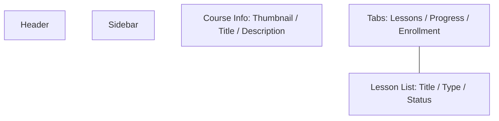
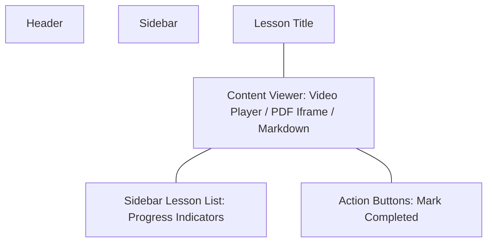
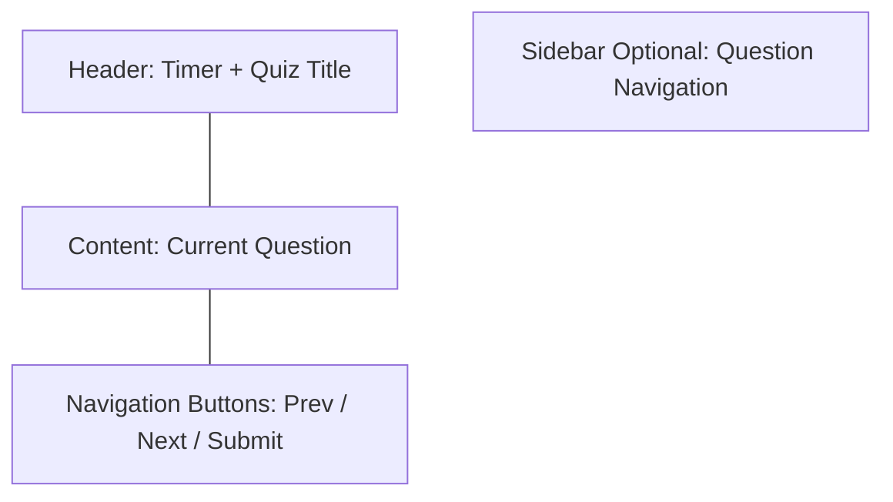
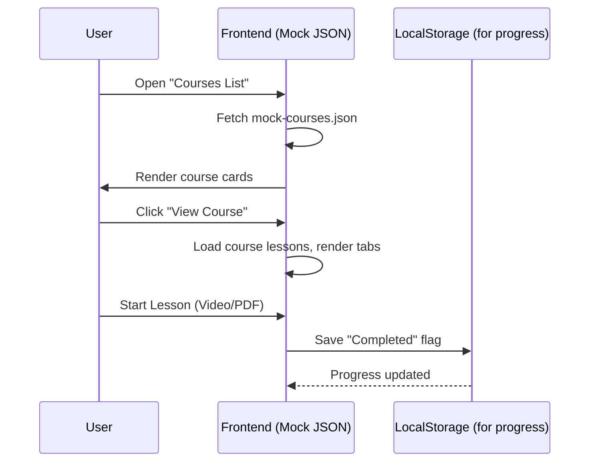

# Phase I – LMS System – Wireframe & Style Guide

## 1. Wireframe Layout (Mermaid)

### 1.1. Layout Chính (Header + Sidebar + Content)
```mermaid
graph TD
  A[Header: Logo + Avatar + Logout] 
  B[Sidebar: Dashboard / Courses / Lessons / Quizzes / Progress]
  C[Content Area: Dynamic Pages]
  A --- C
  B --- C
````

---

### 1.2. Courses List Page (Grid Card View)

```mermaid
graph TD
  A[Header]
  B[Sidebar]
  C[Search Bar + Filter Dropdown]
  D[Card Grid: Each card = Thumbnail + Title + Short Desc + Progress + Action Button]
  E[Pagination]
  A --- C
  C --- D
  D --- E
```

---

### 1.3. Course Detail Page (Tabs)



---

### 1.4. Lesson Viewer Page



---

### 1.5. Quiz Attempt Page (Student)



---

## 2. Style Guide

### 2.1. Color Palette

* **Primary Blue**: `#2C6EAA` (buttons, headers)
* **Accent Green**: `#4CAF50` (progress bars, success)
* **Light Gray**: `#F5F5F5` (backgrounds)
* **Dark Gray**: `#333333` (text)
* **White**: `#FFFFFF`

### 2.2. Typography

* **Font**: `Roboto`, sans-serif
* **Heading Sizes**:

  * H1: 28px bold
  * H2: 22px semi-bold
  * H3: 18px semi-bold
* **Body Text**: 16px regular

### 2.3. Buttons

* **Primary Button**:

  * Background: Primary Blue
  * Text: White
  * Border Radius: 6px
  * Hover: Slightly darker blue
* **Secondary Button**:

  * Background: White
  * Border: 1px solid Primary Blue
  * Text: Primary Blue
  * Hover: Light Blue background

### 2.4. Cards

* **Style**:

  * White background, subtle shadow (`0 2px 5px rgba(0,0,0,0.1)`).
  * Rounded corners: 8px.
  * Image top, content below.
  * Hover: Lift effect (slight shadow increase).

### 2.5. Tables

* **Header**:

  * Background: Light Gray
  * Bold text
* **Row Hover**:

  * Background: `#f0f8ff`
* **Borders**:

  * Subtle, 1px solid `#e0e0e0`.

### 2.6. Spacing

* **Container Padding**: 16px.
* **Card Margin**: 12px.
* **Grid Gap**: 16px (desktop), 8px (mobile).

### 2.7. Responsive Rules

* **Breakpoints**:

  * Mobile: < 768px (sidebar collapses to hamburger).
  * Tablet: 768–1024px (2-column card grid).
  * Desktop: >1024px (3-4 column grid).
* **Tables**: Horizontal scroll on mobile.

---

## 3. Global Components

* **Header Component** (HTML snippet):

  * Logo left, nav menu right (user avatar + logout).
* **Sidebar Component**:

  * Collapsible.
  * Menu items: Dashboard, Courses, Lessons, Quizzes, Progress.
* **Modal Component**:

  * Reusable for forms (Add Course, Add Quiz, etc.).
* **Toast Notifications**:

  * Position: top-right, fade in/out.

---

## 4. Sample Interaction Flow (Mermaid Sequence)


